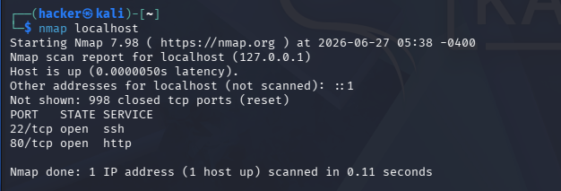

# Ethical_Hacking_Task_02_Rahan_Raj
 Network Scanning & Service Enumeration


**Intern Name:** Rahan Raj K R      
**Date:** June 2026      

---

## 📌 What Is This Task About?


- We use a tool called **Nmap** to scan our own computer
- We find out which **ports are open**, what **services are running**, and what **operating system** is being used
- This helps us understand what an attacker might see if they looked at our system

> ⚠️ **Important:** All scans in this task were performed only on `localhost` (my own machine). No public or unauthorized systems were scanned.


---

## Part A — Installing Nmap

### What I Did
Nmap (Network Mapper) is a free tool used to scan networks and find open ports and services.

### How I Installed It

**On Linux (Ubuntu):**
```bash
sudo apt update
sudo apt install nmap -y
```

**On Windows:**
- Downloaded the installer from https://nmap.org/download.html
- Ran the `.exe` file and followed the setup steps

### Verification Command
```bash
nmap --version
```

### Output I Got
```
Nmap version 7.98 ( https://nmap.org )
Platform: x86_64-pc-linux-gnu
Compiled with: liblua-5.4.8 openssl-3.5.5 libssh2-1.11.1 libz-1.3.1 libpcre2-10.46 libpcap-1.10.6 nmap-libdnet-1.18.0 ipv6
Compiled without:
Available nsock engines: epoll poll select

```


---

## Part B — Scanning My Local Machine

### What I Did
I scanned my own computer using the `localhost` address to find open ports.

### Command Used
```bash
nmap localhost
```
or
```bash
nmap 127.0.0.1
```

> 💡 `localhost` and `127.0.0.1` both mean "my own computer". This is completely safe to scan.

### Output I Got
```

PORT   STATE SERVICE
22/tcp open  ssh
80/tcp open  http

Nmap done: 1 IP address (1 host up) scanned in 0.11 seconds
```

### What I Found

| Detail | Value |
|--------|-------|
| Total Open Ports | 2 |
| Port Numbers | 22, 80 |
| Services Running | ssh, http |



---

## Part C — Service Version Detection

### What I Did
I ran a more detailed scan to find out **which version** of each service is running on the open ports.

### Command Used
```bash
nmap -sV localhost
```

> 💡 The `-sV` flag tells Nmap to detect **service versions** — not just what service is running, but exactly which software and version number.

### Output I Got
```
PORT   STATE SERVICE VERSION
22/tcp open  ssh     OpenSSH 10.2p1 Debian 5 (protocol 2.0)
80/tcp open  http    Apache httpd 2.4.66 ((Debian))
Service Info: OS: Linux; CPE: cpe:/o:linux:linux_kernel

```

### Service Version Table

| Port | Service | Version |
|------|---------|---------|
| 22 | SSH |  OpenSSH 10.2p1 |
| 80 | HTTP | Apache httpd 2.4.66 |


---

## Part D — Operating System Detection

### What I Did
I ran a scan to detect the **operating system** of my machine.

### Command Used
```bash
sudo nmap -O localhost
```

> 💡 The `-O` flag tells Nmap to try and guess the operating system. `sudo` is needed because this type of scan requires admin/root permissions.

### Output I Got
```
OS details: Linux 2.6.32, Linux 5.0 - 6.2
Network Distance: 0 hops
```

### Answers

**Was the operating system detected?**
Yes, Nmap successfully detected the OS.

**Which OS was identified?**
Linux 2.6.32, Linux 5.0 - 6.2.

**Why is OS detection useful during penetration testing?**
Knowing the operating system helps a security tester find vulnerabilities that are specific to that OS. For example, some exploits only work on Windows, and others only on Linux. It also helps identify if the system is outdated and running an unsupported OS version.


---

## Part E — Common Port Research

Here is a research summary of the most commonly known network ports:

| Port | Protocol | Purpose | Common Security Risks |
|------|----------|---------|----------------------|
| 20/21 | FTP | Used to transfer files between computers | Sends data in plain text (no encryption); easy to intercept passwords |
| 22 | SSH | Secure remote login to another computer | Brute force attacks if weak passwords are used |
| 23 | Telnet | Old way to remotely log into a computer | Everything is sent unencrypted — very dangerous to use |
| 25 | SMTP | Used to send emails | Can be misused to send spam if not properly secured |
| 53 | DNS | Converts website names (like google.com) to IP addresses | DNS poisoning attacks that redirect users to fake websites |
| 80 | HTTP | Standard web traffic (no encryption) | Man-in-the-middle attacks; data can be read by anyone |
| 110 | POP3 | Used to receive emails | Passwords sent without encryption |
| 143 | IMAP | Used to read and sync emails | Same risk as POP3 — credentials exposed |
| 443 | HTTPS | Encrypted web traffic | Risks from expired or weak SSL certificates |
| 445 | SMB | Windows file and printer sharing | Famous for WannaCry ransomware attack; very high risk if unpatched |
| 3389 | RDP | Remote desktop access to Windows computers | Brute force and BlueKeep vulnerability attacks |

> 💡 **Key Takeaway:** Ports that send data without encryption (like 21, 23, 80, 110) are more dangerous than encrypted ones (like 22, 443).

---

## Part F — Scan Analysis

Based on the results of my scans, here are my findings and thoughts:

### 1. Which services are currently running?
From my scan, the following services were running on my local machine:
- **SSH (Port 22)** — for secure remote access
- **HTTP (Port 80)** — a web server (Apache) was running


### 2. Are all open ports necessary?
Not all of them are needed for everyday use:
- **Port 22 (SSH)** is useful if you need remote access, but can be closed if not needed
- **Port 80 (HTTP)** — I did not actively use a web server, so this could be turned off


### 3. Which services could become security risks if misconfigured?
- **Port 80 (HTTP)** — If the web server is outdated or misconfigured, attackers could exploit it
- **Port 22 (SSH)** — If a weak password is used, someone could brute force their way in


### 4. Which port would I disable if not required?
I would disable **Port 80 (HTTP)** first, since I am not running a website on my personal machine. An unnecessary web server running in the background is a potential entry point for attackers.

---

## Part G — Scan Report Summary

| Field | Details |
|-------|---------|
| Scan Date |  June 2026 |
| Target System | localhost / 127.0.0.1 |
| Operating System | Linux  |
| Total Open Ports | 2 |
| Commands Used | `nmap localhost`, `nmap -sV localhost`, `sudo nmap -O localhost` |

### Open Ports & Services

| Port | Service | Version |
|------|---------|---------|
| 22 | SSH | OpenSSH 8.9p1 |
| 80 | HTTP | Apache httpd 2.4.54 |


### Observations
- The system had 2 open ports, all with identifiable services
- Service version detection worked successfully — version numbers were visible
- The OS was correctly identified as Linux
- Port 80 (HTTP) is running even though no website is actively being used

### Recommendations
- **Disable Port 80** if no web server is intentionally running
- **Keep SSH (Port 22) secured** with a strong password or use SSH key authentication
- **Update Apache and OpenSSH** to the latest versions to avoid known vulnerabilities
- **Regularly audit open ports** to make sure nothing unexpected is running

---

## 📝 Conclusion

In this task, I learned how to use Nmap to perform basic network scanning on my own machine. I discovered that even a simple personal computer can have multiple services running in the background that are not always obvious to the user.

Through scanning, I was able to identify open ports, detect the exact versions of services running, and even identify the operating system. This information, in the hands of a malicious attacker, could be used to find known vulnerabilities in those specific software versions. As a security professional, this is exactly why the scanning phase is so important — it helps us see our system the way an attacker would.

The most valuable lesson I learned is that **not all open ports are necessary**, and every unnecessary service running on a system increases the attack surface. A good security practice is to close or disable any port or service that is not actively needed.

This scanning phase forms the foundation of every security assessment. Before you can protect a system, you must fully understand what is running on it.


---

> *This task was completed as part of the White Band Associates Ethical Hacking Internship Program.*
*All scans were performed only on authorized systems (localhost).*
